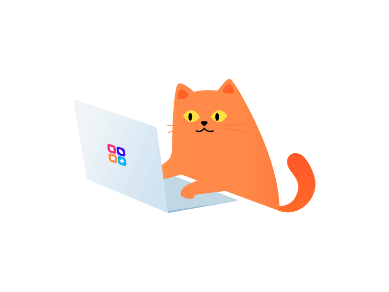

### Hello World, I'm Dmitry

  

## 📖 About me

- 👀 Interested in **Software** and **Game Development**
- 🌱 Currently studying to become a **programmer**
- ☕ Learning **new** technologies to become **better**

### Languages and Tools

        

