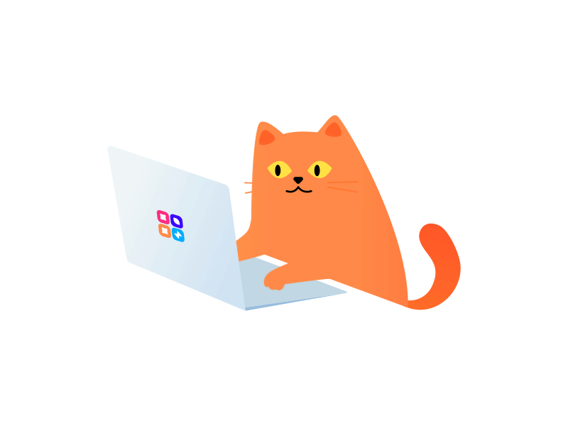

### Hello World, I'm Dmitry 

## 📖 About me

- 👀 Interested in **Software** and **Game Development**
- 🌱 Currently studying to become a **programmer**
- ☕ Learning **new** technologies to become **better**

### 📫 Connect with me 

 

### Languages and Tools

<code></code>
<code></code>
<code></code>
<code></code>
<code></code>
<code></code>

  
:zap: 📈 My GitHub Stats 

  

